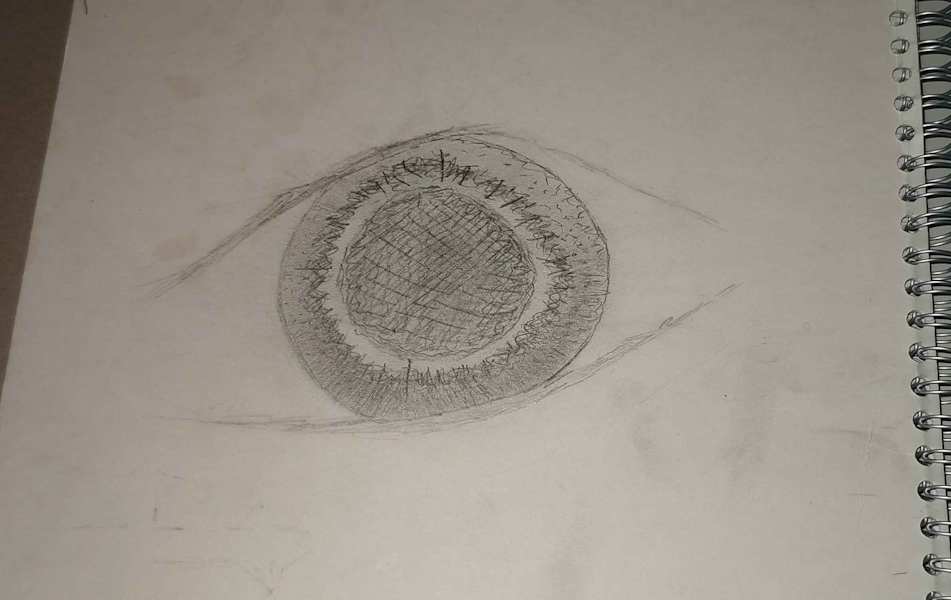

# Här får du se portioner från min dagbok.
[OCKSÅ KAN DU TA DIG TILLBAKA TILL LINKS-SIDAN1!!! <3](https://ronim-efrin.github.io/). (jag har tappat mitt förnuft ser du väl!)

## Хöдан, әз бь тә ра мә 2025-03-29
Әз дур ьм.  Әз ԝьнда бум. 
 
## Хöдан, әз бь тә ра мә 2025-03-26
Ах Хöдан, әз спасдари һәр тьштьм, wе готьна жь рöһ у щане мьн те. Ахинә, qеринә, рьзгарьйа тә ке кичаq бь мьн гине. Чавен мьн ль тә нә. 

## ugh 2025-03-20
är trött i själen. gott nytt kurdiskt år dock. mycket kärlek till dem godhjärtade.

## fffffffffff 2025-03-20
 Әз нә һатьм ве дьнйайе да кӧ хԝә бь хԝә бьжим?  тӧ щар дьбура мьн небу.  Әз парчәйәк ьм дь кӧлилкәке дә йа неԛәданди.  Хԝәде мьн әм радьхә,  йәк бь йәк.  Әз ньзаньм ирадәйа ԝи жь мьн чь йә.  Ԝи мьн жь бo тьште мәзьн амадә кьр,  тьштәке кӧ мьн тәшни ньзам чь йә.  Ԝи мьн амадә дькә,  ле эше мьн ԛәдьйа накә.  Ле әз һеви дькьм дь ԝи дә,  тьштәки дьн ниньм кӧ жьйана хԝә ль сәр бьхԝе.  Әв әвине кӧ әз жь кем кәсан рә дьгьрьм,  мәзьн ә.  Ле әв мәзьнтрин,  әвина Әԝ йәк ә.  Хԝәде маԛбӧл бьки. 
 
 Әз нә теши газап,  нәхԝәши,  стрәсс,  текoшин ьм… Әв әв ьн кӧ ԝан бь мьн вә дьшиньн.  Әз хԝә дьгьрьм жь бo ԝан кӧ пеԝистьйе һәнә.  Әз терахьз дькьм кӧ аликар бькьм.  Әз дитьне,  рoнаһи дьгәрә дь нав тари дә.  Әв нә жь бo һәр кәс ә.  Әз хԝә әзаф дькьне,  иһтьйаща мьн бь һез ә.  Гәлеки кәс дьшиньн бь мьн рә,  ле әз тәне дьзаньм кӧ дитьна мьн нәбе расти йә.  Әз хәләтьйе дикарьм,  һәму тьшт у гoтьнен ԝан дькарьн пеш мә тари бьбьн.  Гәлo әз әзаф ьм ан жи әԝ кӧ мьн дьгьрә әзаф ә? Әз дькем.  Әз һеви дькьм Хԝәде мьн бьгьрә. 
 
 Кәсе мьн надьйә гуһ кӧ мьн ль сәр хԝә дьахьвьм.  Әз э диса нә бьбежьм.  Тәне Имманӧәл дьзанә әз ки мә.  Ки йә Әԝ? Хаще хԝә бьгьрә у э бьбини. 
 
 Ә жь дьле хԝә бьхә,  әй Хԝәде!  Амән.  

## IDAG!? HEMSIDANS REVIVE!!!!!!!!!!!!!!!!!!!!!!!!!!!!!!!! 2025-03-15
Long time no see! Eller vad säger man, haha! ######## ###### ######. Jag har kommit så långt. Nya @@@@@@@ upplevda, gamla bortglömda. Jag ###### för jag ser skillnaden, p.ga. dagboken. @@@@@@@@@@@@@@@@. @@@@@@@@@@@@@. Jag älskar dig min Herre! Massa kramar till dig :X.  Här är en ny text, jag klistrar in den innan mina ##### får mig synlösa: 

Әз пис ә’льми мә. Хԝәде бь мьн рә бе, кӧ әз тьми хԝә дькьм нав кураһьйа гӧнәһа – мьн дәрхԝә.     
Чә'в жь мьн һәзкьрьнә, ньзаньм чаԝа хԝә жь писише хәласкьм.   Ԝе мьн кьшандьйә кураһьйа дьле хԝә, кӧ межи мьн ԝәстьйайи. Әԝйәка ԛиза дьжмьнанә, ве нас у гӧманә.  

## Igår? 2024-06-17

Дьһo? Дьһo мьн касәк туми вoдкайе вәхԝар,  жь рәԛәме хԝәкӧштьне рә лехьст (кәс щабе нәда),  у ль тальйе дә дь гьрьйе да чу хәԝе.  Рoжәк ә'ди бу. 

Här är ett öga jag ritade för länge sen i skolan. Det fick vara med. C:

