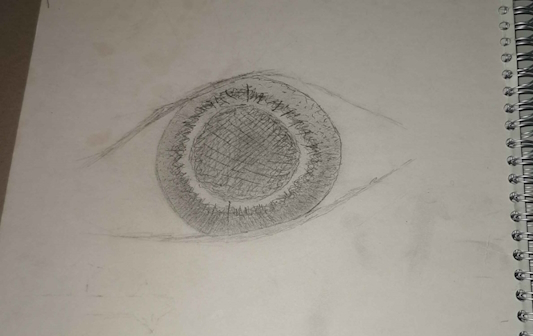

# Här får du se portioner från min dagbok. Döm gärna inte; jag är gammalmodig och flyter iväg i mina tankar väldigt enkelt. 
Du kommer behöva musik om du ska ta dig igenom denna sida med ditt förnuft kvar. [Lyssna på min spellista](https://music.youtube.com/playlist?list=PLS-abqU6QBvgYYGYxbqw-UFybw5b818G0).[OCKSÅ KAN DU TA DIG TILLBAKA TILL LINKS-SIDAN1!!! <3 AAAAAAAAAA](https://ronim-efrin.github.io/).

## IDAG!? HEMSIDANS REVIVE!!!!!!!!!!!!!!!!!!!!!!!!!!!!!!!! 2025-03-15
Long time no see! Eller vad säger man, haha! Jag gråter av glädje. Jag har kommit så långt. Nya trauman upplevda, gamla bortglömda. Jag gråter för jag ser skillnaden, p.ga. dagboken. God gave it a purpose. God gave me a purpose. Jag älskar dig min Herre! Massa kyssar till dig :X.  Här är en ny text, jag klistrar in den innan mina tårar får mig synlösa: 
Әз пис ә’льми мә. Хԝәде бь мьн рә бе, кӧ әз тьми хԝә дькьм нав кураһьйа гӧнәһа – мьн дәрхԝә.     
Чә'в жь мьн һәзкьрьнә, ньзаньм чаԝа хԝә жь писише хәласкьм.   Ԝе мьн кьшандьйә кураһьйа дьле хԝә, кӧ межи мьн ԝәстьйайи. Әԝйәка ԛиза дьжмьнанә, ве нас у гӧманә.  

## Igår? 2024-06-17

Igår drack jag ett vattenglas vodka, ringde självmordslinjen (ingen svarade), och tillslut grät jag mig själv till sömns. Inte min värsta dag.

Här är ett öga jag ritade för länge sen i skolan. Tyckte det var fint, så det fick vara med. C:

## 2024-03-15

Upplevde en chock idag, igen. Utan att bli arg eller sur, vill jag berätta i skillnaderna mellan tankeprocesserna jag har upplevt mellan mig och människorna runtom. Dessa människor är så fokuserade på nuet och sig själva att dom är blinda till exakt allt annat. Hur kan man, som en hudsäck, vara så stolt över sig själv? Dom lever så mycket i synd och har inte tagit emot Kristus, dom ursäktar allting dom gör och letar endast och alltid självisk fullkomlighet och tillfredsställande. Deras själar är så förrådda att man inte ens kan få ett skymt av Gud i dem. Åh, herren Kristus, rädda oss allihopa; dina barn är så vilseledda. Jag är som dem, fylld med synd. Men jag letar fullkomlighet i din ära, åh min älskade herre. 
På samma not, dem är helt blinda blinda till visioner av möjligheter och alternativa realiteter. Är det kanske något jag har givits av Gud? Jag är tacksam för allt du gör för mig, min Gud. Min all-älskade och beundrade, fyll mig med anden och ta över mitt liv och styr mig åt rätt håll. Så jag kan uppfyllas i dina ord och din ära. Amen

## Rop för hjälp, datumlöst

## Gnosis, datumlöst

